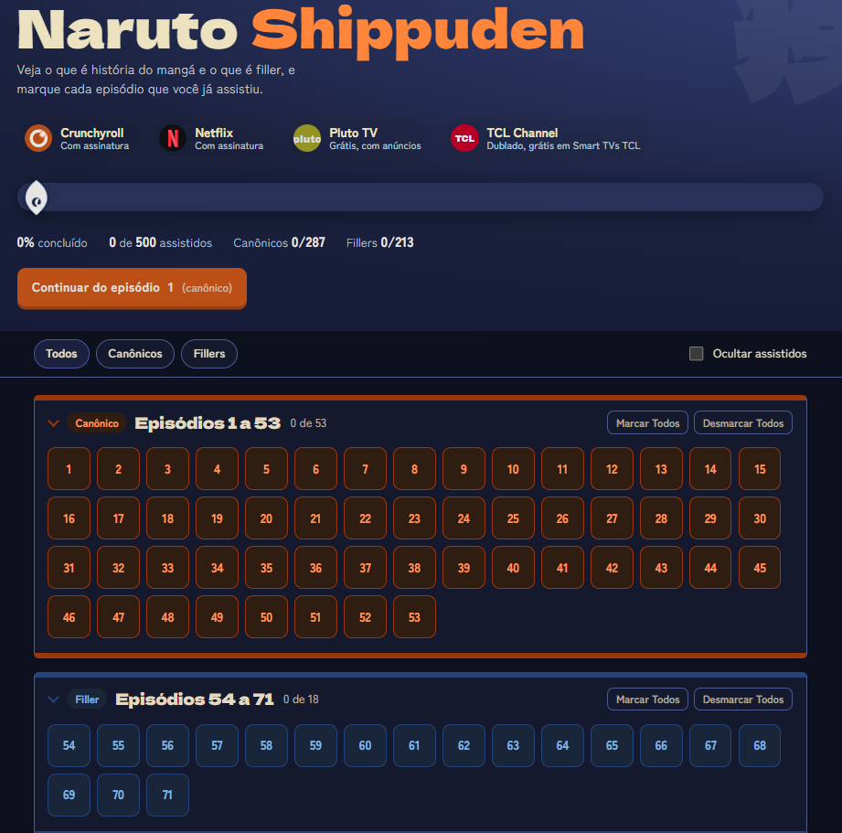

# Naruto Shippuden Tracker

Lista dos 500 episódios de **Naruto Shippuden** separados entre **canônicos** e **fillers**, com controle de episódios assistidos salvo no próprio navegador.

🔗 **Demo:** https://Vinicius-Pepi.github.io/naruto-shippuden-tracker/

## Funcionalidades

- Episódios agrupados em blocos consecutivos de canônicos e fillers
- Marcar e desmarcar episódios individualmente ou por bloco
- Progresso salvo no navegador (`localStorage`), sem cadastro e sem servidor
- Botão "Continuar" que leva ao episódio seguinte ao último marcado
- Filtros por tipo de episódio e opção de ocultar os já assistidos
- Barra de progresso com o símbolo de Konoha
- Tema claro e escuro, de acordo com o dispositivo
- Layout responsivo e navegação por teclado

## Tecnologias

HTML, CSS e JavaScript puros, em um único arquivo. Sem dependências ou etapa de build.

## Como rodar localmente

Baixe o `index.html` e abra no navegador. Não é preciso instalar nada.

## Como ajustar a lista de fillers

Os intervalos ficam na constante `FILLER_RANGES`, no início do script do `index.html`. Cada par é `[episódio inicial, episódio final]`. Encontrou algum erro na lista? Abra uma *issue* ou um *pull request*.

## Aviso legal

Projeto de fã, sem fins lucrativos e sem vínculo com os detentores dos direitos. Naruto © Masashi Kishimoto / Shueisha, TV Tokyo, Studio Pierrot. As marcas dos serviços de streaming pertencem aos seus respectivos donos, e os ícones exibidos são versões simplificadas.

## Licença

Código distribuído sob a licença [MIT](LICENSE).
